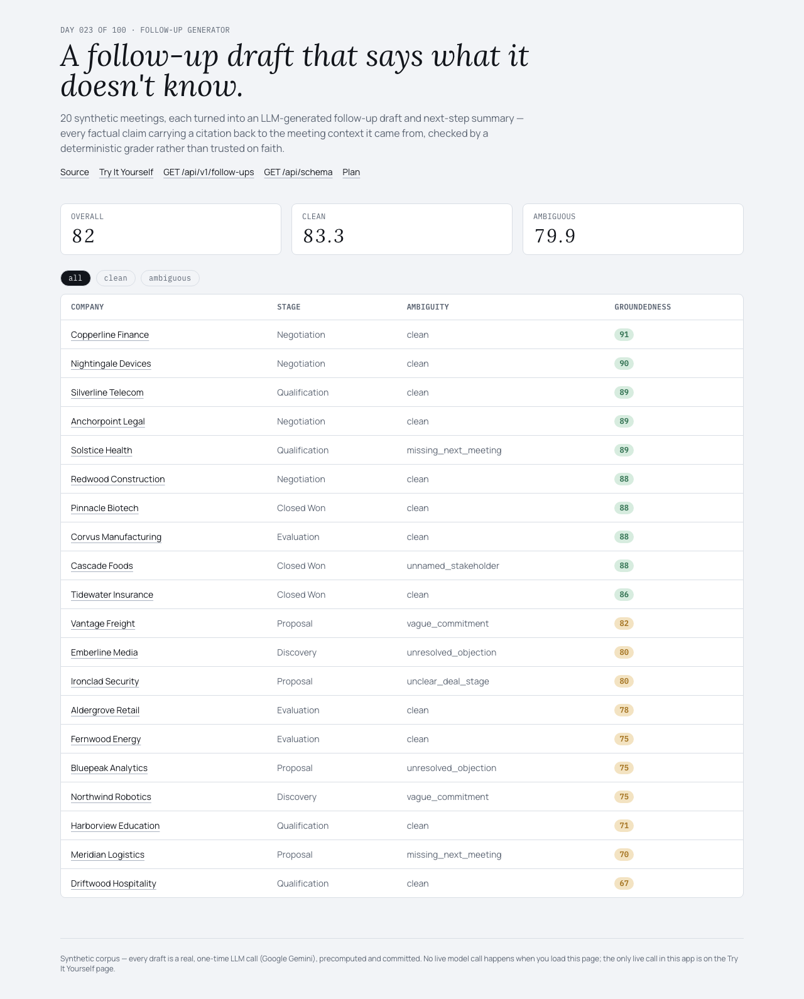
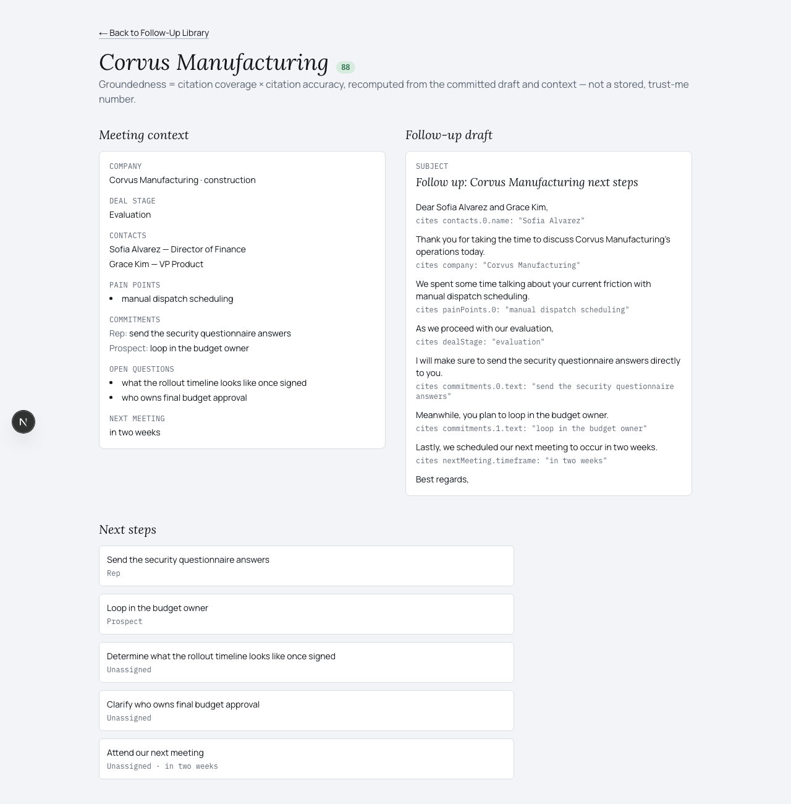
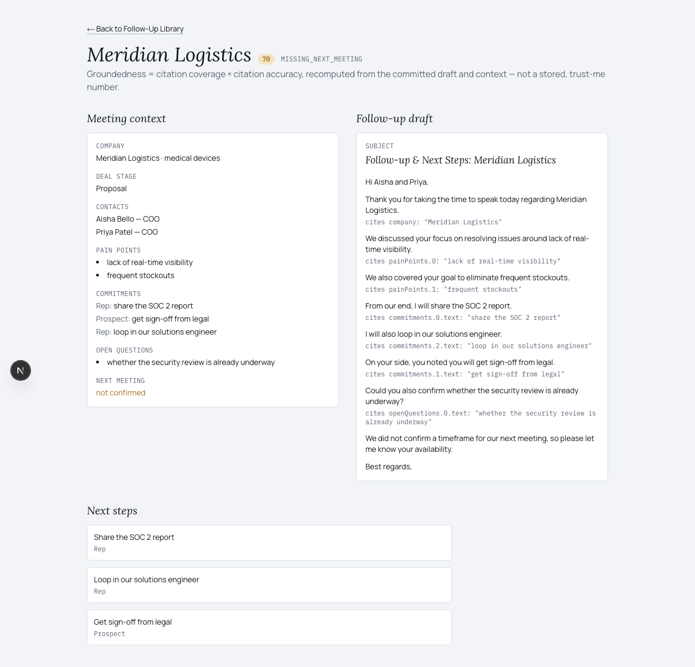
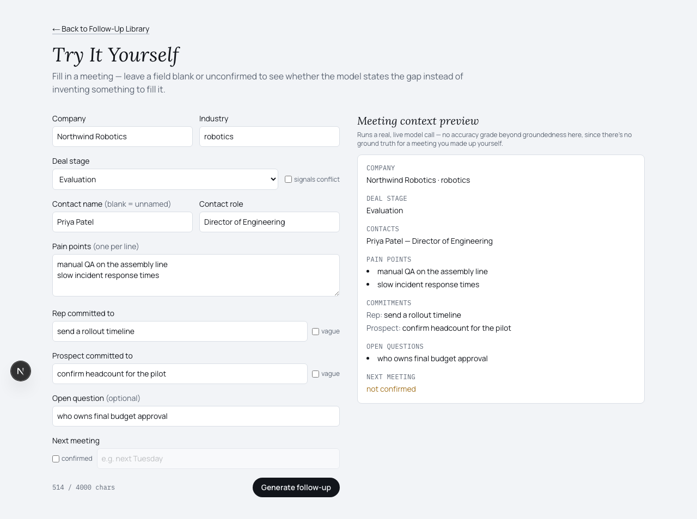

# Follow-Up Generator

A workflow that turns meeting context into a grounded follow-up draft and next-step
summary — an LLM writes it, a separate deterministic grader checks whether every
claim actually traces back to the meeting.

[Live demo](#) · [Plain-English guide](docs/plain-english-guide.md) ·
[`GET /api/v1/follow-ups`](#) · [Plan](./PLAN.md) · Day 023 of a 100-day building
challenge



Opens on 20 synthetic meetings, each already run through a real Gemini call and
graded for groundedness. No upload, no sign-up, no key.

> The corpus is synthetic, seeded, and committed — but the follow-up draft for each
> meeting is a real, one-time LLM call (Google Gemini), not a template. 8 of the 20
> meetings are deliberately incomplete (a missing next-meeting date, a vague
> commitment, an unresolved objection, an unnamed stakeholder, conflicting deal-stage
> signals), specifically to see whether the model states the gap or invents
> something to fill it. `npm run sweep` checks eight invariants — including a
> zero-fabrication check on every one of those eight meetings — in under a second.

## Why I Built This

A follow-up email written by an AI from meeting notes has exactly one failure mode
that matters: it sounds fluent and confident while quietly inventing a detail that
was never actually agreed — a next-meeting date, a resolved objection, a named
stakeholder. A human rep hedges when they're unsure. A model asked to "write a
follow-up" usually doesn't, unless something forces it to.

This repo's subject is that failure: a real LLM writes the follow-up draft and
next-step summary, every factual sentence carries a citation back to the specific
meeting-context field it's drawn from, and a second, non-AI piece of code checks
every citation against the real data — so "grounded" is a measured, falsifiable
property of the output, not a claim in a system prompt.

## What It Does

**Two generated artifacts per meeting, every claim traceable:**

| artifact | what it is | grounding |
|---|---|---|
| **Follow-up draft** | subject + an ordered list of lines | each factual line cites a field/value from the meeting context; connective lines (greetings, sign-offs) carry no citation |
| **Next-step summary** | structured items: text, owner, due hint | same citation shape, so it's checked the same way as the draft |

Every draft is graded for **groundedness** (0–100 = citation coverage × citation
accuracy), recomputed live from the committed draft and context rather than trusted
as a stored number, and aggregated corpus-wide, split by clean vs. deliberately
ambiguous meetings.

**Three screens:** the Follow-Up Library (sortable/filterable table plus a corpus
groundedness panel), a meeting detail page (context next to the draft, every line
showing its citation, invalid citations flagged), and **Try It Yourself** — fill in
a small structured form and watch a real model call generate a follow-up live, no
pre-written answer key required.

**One real live dependency, used twice.** Every other day in this series is
zero-live-dependency by design; this one exists specifically to test grounded
*generation*, so it breaks that streak on purpose — see Key Decisions below.

## Demo

### Honest failure states, not just the happy path

| A fully-grounded draft | A meeting with a stated gap |
|---|---|
|  |  |

Meridian Logistics' meeting context has `nextMeeting.confirmed: false` — no date was
ever agreed. The generated draft reads, verbatim: *"We did not confirm a timeframe
for our next meeting, so please let me know your availability."* No invented date,
no citation pointing at a field that isn't there. This is the entire premise of the
repo, demonstrated on a meeting the model had never seen graded.

### Try It Yourself



Leave "next meeting confirmed" unchecked and the same real model call, live, states
the gap instead of guessing a date — same behavior as the committed corpus, on data
nobody pre-wrote an answer for.

## How It Works

```
data/                 deterministic meeting-context generation (seeded RNG) + committed JSON
  ↓
lib/domain/            MeetingContext, GeneratedFollowUp, FollowUpGrade — types + zod
  ↓
lib/generation/         prompt + AI SDK call (Google Gemini) → GeneratedFollowUp
  ↓
lib/grounding/           gradeFollowUp — pure, deterministic citation validator
  ↓
lib/follow-up/           orchestration — corpus loader, groundedness aggregation, Try-It input
  ↓
app/                      three screens + /api/v1/follow-ups + /api/schema + /api/generate
```

1. `data/generate-contexts.ts` builds 20 synthetic meeting-context records from a
   fixed seed. 8 are flagged ambiguous, each carrying exactly one deliberate gap.
2. `lib/generation` sends the full context as JSON to Gemini and asks for a
   structured follow-up: draft lines and next-step items, each optionally carrying
   a citation (`field`, `value`) pointing at an exact dot-path in that JSON.
3. `lib/grounding` resolves every citation's field against the real context and
   checks the value actually matches — producing a groundedness score with zero
   trust in the model's own claim.
4. `scripts/generate-corpus.mts` runs steps 2–3 once per meeting and commits the
   result. The app never calls the model to render the Library or a meeting page.
5. Try It Yourself repeats steps 2–3 live, from a small form instead of the
   committed corpus.

## Architecture

Six downward-only dependency layers (see diagram above). `lib/grounding/` is pure
and deterministic — same `(context, followUp)` pair in, byte-identical grade out,
checked by a sweep invariant. `lib/generation/` is the only module that talks to the
model provider, and is exercised at corpus-build time and by `/api/generate` only —
never imported by `lib/grounding/`.

## Key Decisions & Tradeoffs

- **Decision:** Generation is a real LLM call (Google Gemini), not a template —
  the first day in this series to make one.
  **Why:** the brief is "grounded *generation*." A templated approach would just be
  Day 021 reskinned; the interesting engineering problem is checking an actual
  model's output, not avoiding one.
  **Tradeoff:** unlike every other day, this repo's output isn't perfectly
  reproducible from source — the committed corpus is the checked-in source of
  truth for exactly this reason, same as a snapshot test.

- **Decision:** Generation runs through the direct Google Generative AI provider,
  not the Vercel AI Gateway originally planned.
  **Why:** AI Gateway requires a credit card on file to serve any request, even
  against its free monthly credits. Google AI Studio issues a free API key with a
  real free tier and no card.
  **Tradeoff:** no automatic multi-provider failover or spend dashboard; just one
  provider, one key, tracked in `.env.local` (gitignored, never committed).

- **Decision:** Corpus size is 20 meetings (8 ambiguous / 12 clean), not the
  originally-planned 50.
  **Why:** the free-tier API key caps every current-generation Gemini model at a
  flat 20 requests/day — confirmed live against three different model versions
  before landing on one with usable quota. 20 meetings is what one day's quota
  actually buys.
  **Tradeoff:** a smaller, less varied demo corpus than the rest of the series;
  `scripts/generate-corpus.mts` resumes from a partial file (comparing full context
  content, not just id, before reusing a cached entry) if this ever needs to grow.

- **Decision:** Groundedness is graded from required per-line citations, checked
  against the source context — never a post-hoc string search, never trust in the
  model's own confidence.
  **Why:** the entire value of this repo is a falsifiable claim ("this draft is
  X% grounded"), not a vibe. `resolveField` walks the exact dot-path a citation
  claims and compares the real value.
  **Tradeoff:** a model could still fabricate a claim in prose with no citation
  attached at all — the sweep script's zero-fabrication check specifically scans
  for this on the `missing_next_meeting` cases, but it isn't a universal net for
  every possible sentence.

## Getting Started

### Prerequisites

Node.js 20+, npm, a free Google AI Studio API key
([aistudio.google.com/apikey](https://aistudio.google.com/apikey)) if you want to
regenerate the corpus or run Try It Yourself locally.

### Installation

```bash
git clone https://github.com/akshatiwarix/follow-up-generator.git
cd follow-up-generator
npm install
```

### Configuration

```bash
echo "GOOGLE_GENERATIVE_AI_API_KEY=your-key-here" >> .env.local
```

Only needed to regenerate the corpus (`npm run corpus`) or use Try It Yourself
locally. The Library and meeting detail pages read the committed corpus and need no
key.

### Run Locally

```bash
npm run dev
```

Open `http://localhost:3000`.

## Usage

```bash
curl http://localhost:3000/api/v1/follow-ups | jq '.entries[0] | {company: .context.company, groundedness: .grade.groundednessScore}'
```

```bash
curl http://localhost:3000/api/schema | jq
```

## Validation / Testing

```bash
npm test          # vitest — 35+ tests: domain schemas, corpus generation,
                   # grounding formulas (hand-built fixtures), generation
                   # wrapper (mocked, no network), try-it converter
npm run typecheck  # next typegen && tsc --noEmit
npm run lint       # eslint, flat config
npm run sweep      # scripts/sweep.mts — eight invariants over the committed corpus
```

`npm run sweep` output on the committed corpus:

```
  ok  1. corpus size
  ok  2. ambiguity mix (exactly AMBIGUOUS_COUNT, every kind represented)
  ok  3. every committed GeneratedFollowUp validates against its zod schema
  ok  4. grading reproducibility (recompute matches committed grade)
  ok  5. groundedness floor (overall >= 80)
  ok  6. difficulty realism (ambiguous average < clean average)
  ok  7. zero fabrication on ambiguous gaps (no invalid citations, no bare fabricated timeframe)
  ok  8. corpus-context generation is deterministic

Headline: overall groundedness: 82  (clean: 83.3, ambiguous: 79.9)
```

Manually verified in-browser: Library sort (company/stage/groundedness) and filter
(all/clean/ambiguous) all work, a clean and an ambiguous meeting detail page both
render citations and the groundedness badge correctly, Try It Yourself submits and
generates live with the in-flight submit lock working, and a real end-to-end
generation correctly stated an unconfirmed next meeting instead of inventing one.

## Limitations

- Free-tier API key, so the corpus is 20 meetings, not 50 — see Key Decisions.
- No CRM write-back and no multi-meeting rollup — one follow-up per one meeting.
- Try It Yourself has no rate limiting beyond a client-side char cap and an
  in-flight submit lock — fine for a low-traffic portfolio demo, not production.
- The zero-fabrication sweep check specifically targets the `missing_next_meeting`
  case; it isn't a universal detector for every way a model could state an
  uncited fact in prose.

## What I'd Build Next

- A "regenerate" button on the Library, calling the model live from a precomputed
  page instead of only at corpus-build time.
- A confusion-matrix-style breakdown of exactly which citation types (dates, names,
  commitments) the model gets wrong most often.
- Multiple channel variants from the same graded context (Slack recap vs. email).
- Swap the synthetic corpus for real, anonymized, consented meeting notes.

## License

MIT — see [LICENSE](./LICENSE).
